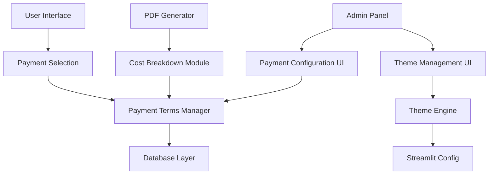
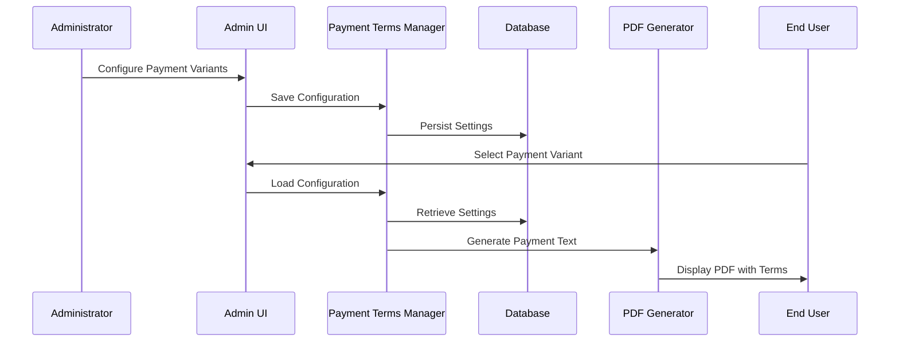

# Design Document

## Overview

The dynamic payment system feature extends the existing solar calculator application with a comprehensive payment configuration system. The design integrates seamlessly with the current architecture while adding three main components:

1. **Payment Terms Configuration System** - Admin interface for configuring up to four payment variants with customizable percentages, fixed amounts, and text templates
2. **PDF Cost Breakdown Enhancement** - Enhanced page 7 of PDF output with detailed cost breakdown and payment terms integration
3. **Theme Management System** - Switchable UI themes for enhanced user experience and branding customization

The system builds upon the existing `payment_terms.py` module and `admin_panel.py` structure, extending them with new functionality while maintaining backward compatibility.

## Architecture

### Component Overview



### Data Flow



## Components and Interfaces

### 1. Payment Configuration Manager

**Location**: Extension of existing `payment_terms.py`

**Key Classes**:
- `DynamicPaymentConfigManager` - Manages the four payment variants
- `PaymentVariant` - Represents individual payment configuration
- `PaymentSegment` - Individual payment installment within a variant

**Interface**:
```python
class DynamicPaymentConfigManager:
    def load_payment_variants(self) -> Dict[str, PaymentVariant]
    def save_payment_variants(self, variants: Dict[str, PaymentVariant]) -> bool
    def get_variant_by_id(self, variant_id: str) -> Optional[PaymentVariant]
    def calculate_payment_amounts(self, variant_id: str, total_amount: float) -> List[PaymentSegment]
    def generate_payment_text(self, variant_id: str, segments: List[PaymentSegment]) -> str
    def validate_variant_configuration(self, variant: PaymentVariant) -> List[str]

class PaymentVariant:
    id: str
    name: str
    segments: List[PaymentSegment]
    text_template: str
    is_fixed_variant: bool  # True for Variant 2 (100% after completion)

class PaymentSegment:
    key: str
    label: str
    percent: Optional[float]
    fixed_amount: Optional[float]
    calculated_amount: float
```

### 2. Admin UI Components

**Location**: Extension of existing `admin_panel.py`

**New Functions**:
- `render_payment_configuration_ui()` - Main payment configuration interface
- `render_variant_editor()` - Individual variant configuration form
- `render_payment_preview()` - Live preview of payment calculations
- `render_theme_management_ui()` - Theme selection and customization interface

**UI Structure**:
```
Admin Panel
├── Payment Terms Configuration
│   ├── Variant 1: Down Payment Configuration
│   ├── Variant 2: 100% After Completion (Fixed)
│   ├── Variant 3: Two Installments Configuration
│   ├── Variant 4: Custom Configuration
│   └── Preview & Validation
└── Theme Management
    ├── Theme Selection
    ├── Color Customization
    └── Apply Changes
```

### 3. PDF Enhancement Module

**Location**: Extension of existing `pdf_generator.py`

**New Functions**:
- `generate_cost_breakdown_page()` - Creates enhanced page 7 with cost details
- `format_cost_line_item()` - Formats individual cost breakdown items
- `integrate_payment_terms()` - Adds payment terms text below cost breakdown

**Cost Breakdown Structure**:
1. Total system cost (including VAT)
2. VAT deduction (with minus sign)
3. Net amount (after VAT deduction)
4. Discounts/rebates (conditional, with minus sign)
5. Surcharges/additional costs (conditional, with plus sign)
6. Accessories/extras (conditional, with plus sign)
7. Final system cost (with visual separator)
8. Payment terms text (from selected variant)

### 4. Theme Management System

**Location**: New module `theme_manager.py` + extension of `theming/pdf_styles.py`

**Key Components**:
- `StreamlitThemeManager` - Manages Streamlit theme switching
- `ThemeConfiguration` - Represents theme settings
- `ThemeApplicator` - Applies theme changes to Streamlit

**Theme Structure**:
```python
class ThemeConfiguration:
    name: str
    base: str  # "light" or "dark"
    primary_color: str
    background_color: str
    secondary_background_color: str
    text_color: str
    font: str

PREDEFINED_THEMES = {
    "Standard": ThemeConfiguration(...),
    "Dark": ThemeConfiguration(...),
    "Material-Blue": ThemeConfiguration(...),
    "Modern": ThemeConfiguration(...)
}
```

## Data Models

### Payment Configuration Schema

```json
{
  "payment_variants": {
    "variant1": {
      "id": "variant1",
      "name": "Anzahlung / DC-Montage / Inbetriebnahme",
      "type": "configurable",
      "segments": [
        {
          "key": "deposit",
          "label": "Anzahlung",
          "percent": 30,
          "fixed_amount": null
        },
        {
          "key": "dc_montage", 
          "label": "Nach DC-Montage",
          "percent": 40,
          "fixed_amount": null
        },
        {
          "key": "commissioning",
          "label": "Nach Inbetriebnahme", 
          "percent": 30,
          "fixed_amount": null
        }
      ],
      "text_template": "Die Zahlung erfolgt in drei Schritten: {deposit} bei Vertragsabschluss, {dc_montage} nach der DC-Montage und {commissioning} nach Inbetriebnahme."
    },
    "variant2": {
      "id": "variant2",
      "name": "100% nach Fertigstellung",
      "type": "fixed",
      "segments": [
        {
          "key": "full_payment",
          "label": "Nach Lieferung/Installation/Inbetriebnahme",
          "percent": 100,
          "fixed_amount": null
        }
      ],
      "text_template": "Zahlungsbedingungen: 100% des Gesamtbetrags nach erfolgter Installation und Inbetriebnahme."
    },
    "variant3": {
      "id": "variant3", 
      "name": "Ohne Anzahlung (zwei Raten)",
      "type": "configurable",
      "segments": [
        {
          "key": "dc_delivery",
          "label": "Nach DC-Montage/Lieferung",
          "percent": 50,
          "fixed_amount": null
        },
        {
          "key": "commissioning",
          "label": "Nach Inbetriebnahme",
          "percent": 50, 
          "fixed_amount": null
        }
      ],
      "text_template": "Die Zahlung erfolgt in zwei Schritten: {dc_delivery} nach DC-Montage und Lieferung, {commissioning} nach Inbetriebnahme."
    },
    "variant4": {
      "id": "variant4",
      "name": "Komplett individuell",
      "type": "custom",
      "segments": [
        {
          "key": "custom1",
          "label": "Rate 1", 
          "percent": 33.33,
          "fixed_amount": null
        },
        {
          "key": "custom2",
          "label": "Rate 2",
          "percent": 33.33,
          "fixed_amount": null
        },
        {
          "key": "custom3", 
          "label": "Rate 3",
          "percent": 33.34,
          "fixed_amount": null
        }
      ],
      "text_template": "Die Zahlung erfolgt in mehreren individuell definierten Raten: {custom1}, {custom2}, {custom3}."
    }
  },
  "metadata": {
    "version": "1.0",
    "last_updated": "2025-01-20T10:00:00Z",
    "created_by": "admin"
  }
}
```

### Theme Configuration Schema

```json
{
  "active_theme": "Standard",
  "custom_primary_color": "#F63366",
  "themes": {
    "Standard": {
      "base": "light",
      "primaryColor": "#F63366",
      "backgroundColor": "#FFFFFF", 
      "secondaryBackgroundColor": "#F0F2F6",
      "textColor": "#262730",
      "font": "sans serif"
    },
    "Dark": {
      "base": "dark",
      "primaryColor": "#c98bdb",
      "backgroundColor": "#0E1117",
      "secondaryBackgroundColor": "#262730", 
      "textColor": "#FAFAFA",
      "font": "sans serif"
    }
  }
}
```

## Error Handling

### Payment Configuration Validation

1. **Percentage Validation**: Ensure percentages sum to 100% for each variant
2. **Amount Validation**: Validate that fixed amounts are positive numbers
3. **Template Validation**: Check that text templates contain valid placeholders
4. **Segment Validation**: Ensure each variant has at least one segment

### Theme Application Error Handling

1. **Configuration Backup**: Store previous theme before applying new one
2. **Rollback Mechanism**: Automatic rollback if theme application fails
3. **Validation**: Validate color codes and configuration before application
4. **Graceful Degradation**: Fall back to default theme if custom theme fails

### PDF Generation Error Handling

1. **Missing Data Handling**: Provide default values for missing cost breakdown items
2. **Calculation Errors**: Handle division by zero and invalid calculations gracefully
3. **Template Errors**: Fall back to simple text if template rendering fails
4. **Integration Errors**: Ensure PDF generation continues even if payment terms fail

## Testing Strategy

### Unit Tests

1. **Payment Configuration Tests**
   - Test variant creation and validation
   - Test percentage and amount calculations
   - Test text template rendering with placeholders
   - Test configuration persistence and retrieval

2. **Theme Management Tests**
   - Test theme switching functionality
   - Test color validation and conversion
   - Test configuration persistence
   - Test rollback mechanisms

3. **PDF Enhancement Tests**
   - Test cost breakdown calculation and formatting
   - Test payment terms integration
   - Test conditional item display (discounts, surcharges)
   - Test visual formatting and layout

### Integration Tests

1. **End-to-End Payment Flow**
   - Admin configures payment variants
   - User selects variant in PDF creation
   - PDF generates with correct payment terms
   - Cost breakdown displays correctly

2. **Theme Application Flow**
   - Admin selects and customizes theme
   - Theme applies to all UI components
   - Theme persists across sessions
   - Rollback works on errors

3. **Backward Compatibility**
   - Existing payment configurations continue to work
   - Legacy PDF generation remains functional
   - Existing admin panel functionality preserved

### User Acceptance Tests

1. **Admin Workflow Testing**
   - Configure all four payment variants
   - Customize theme settings
   - Validate configuration changes
   - Export/import configurations

2. **User Workflow Testing**
   - Select payment variants during PDF creation
   - View cost breakdown in generated PDFs
   - Experience theme changes in UI
   - Verify payment calculations accuracy

## Performance Considerations

### Configuration Loading
- Cache payment configurations in session state
- Lazy load theme configurations only when needed
- Minimize database queries through intelligent caching

### PDF Generation
- Optimize cost breakdown calculations
- Cache formatted text templates
- Minimize ReportLab object creation overhead

### Theme Switching
- Batch Streamlit configuration updates
- Minimize rerun frequency during theme application
- Cache theme configurations to reduce load times

## Security Considerations

### Input Validation
- Sanitize all user inputs in payment configuration
- Validate color codes and theme parameters
- Prevent injection attacks in text templates

### Data Persistence
- Encrypt sensitive payment configuration data
- Implement proper access controls for admin functions
- Audit trail for configuration changes

### Theme Security
- Validate theme configurations before application
- Prevent malicious CSS injection through color codes
- Secure theme import/export functionality